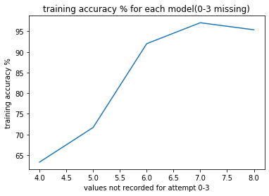
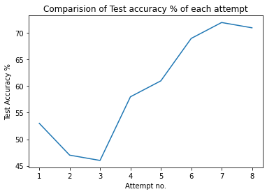
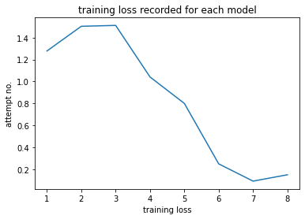
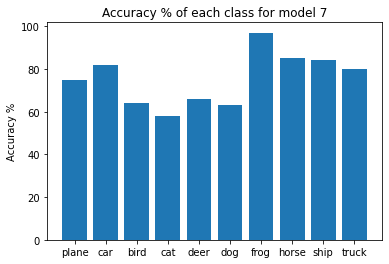

##  

 _Switch to dark mode for better readability_ 

The goal for this project was to build an Image Classifier for the Cifar-10 dataset.

To begin with I started with [PyTorch's Tutorial](https://pytorch.org/tutorials/beginner/blitz/cifar10_tutorial.html#sphx-glr-beginner-blitz-cifar10-tutorial-py) and then proceeded to make multiple changes to the model in an attempt to increase the test accuracy. I tried different things and came up with 7 different approaches(in addition to the existing default code) to tackle this problem.

[Here](https://github.com/rohanmandrekar/Cifar-10-/blob/master/best_attempt(model7).ipynb) is a link to the jupyter notebook with the best results

#### Here is a graph comparing the Training accuracy for modles 4 - 8 :
training accuracy is missing for models 1-3 because I added the attribute in the 4th model



#### Here is a comparision of Test accuracy for each model :



#### Here is a plot showing the trend in loss for each model :



#### This bar graph shows the accuracy of prediction for each class of image seperately :




### Model 1:

#### Test Accuracy : 53% ; Training Accuracy : not calculated ; Loss : 1.278

The first model was the default model provided by PyTorch. This model set the base for this project. My goal was to experiment with Network topology and other hyperparameters to improve the performance (increase test accuracy).
This model consisted of 2 Convolutional layers, 3 fully connected layers, a max pool layer which was applied to each of the convolutional layers. Before applying the max pool layer a Relu activation function was applied to the convolutional layers.

The **Convolutional layer** creates a convolution kernel that is convolved with the layer input to produce a tensor of outputs. If use_bias is True, a bias vector is created and added to the outputs. [_Source_](https://keras.io/api/layers/convolution_layers/convolution2d/)

A **fully connected layer** multiplies the input by a weight matrix and then adds a bias vector. [_Source_](https://www.mathworks.com/help/deeplearning/ref/nnet.cnn.layer.fullyconnectedlayer.html#:~:text=A%20fully%20connected%20layer%20multiplies%20the%20input%20by,to%20all%20the%20neurons%20in%20the%20previous%20layer.)

**Maxpool2D** downsamples the input representation by taking the maximum value over the window defined by pool_size for each dimension along the features axis. The window is shifted by strides in each dimension. The resulting output when using "valid" padding option has a shape(number of rows or columns) of: output_shape = (input_shape - pool_size + 1) / strides). [_Source_](https://www.tensorflow.org/api_docs/python/tf/keras/layers/MaxPool2D)

**ReLU** stands for rectified linear activation unit, it returns 0 if it receives any negative input, but for any positive value x, it returns that value back. Thus it gives an output that has a range from 0 to infinity. [_Source_](https://www.mygreatlearning.com/blog/relu-activation-function/)


```python
class Net(nn.Module):
    def __init__(self):
        super(Net, self).__init__()
        self.conv1 = nn.Conv2d(3, 6, 5)
        self.pool = nn.MaxPool2d(2, 2)
        self.conv2 = nn.Conv2d(6, 16, 5)
        self.fc1 = nn.Linear(16 * 5 * 5, 120)
        self.fc2 = nn.Linear(120, 84)
        self.fc3 = nn.Linear(84, 10)

    def forward(self, x):
        x = self.pool(F.relu(self.conv1(x)))
        x = self.pool(F.relu(self.conv2(x)))
        x = x.view(-1, 16 * 5 * 5)
        x = F.relu(self.fc1(x))
        x = F.relu(self.fc2(x))
        x = self.fc3(x)
        return x
```


### Model 2:

#### Test Accuracy : 47% ; Training Accuracy : not calculated ; Loss : 1.503

To make the dataset more diverse I augmented the data a little using the following transforms :

**Random Horizontal Flip**: Randomly flips some images horizontally from the dataset with probability p=1

**Random Vertical Flip**: Randomly flips some images Vertically from the dataset with probability p=1

**Random Rotate 45deg**: Randomly rotates images by 45 degrees from the dataset

Surprisingly the Test accuracy in this case decreased, which was not expected.

```python
transform = transforms.Compose(
    [transforms.ToTensor(),
     transforms.Normalize((0.5, 0.5, 0.5), (0.5, 0.5, 0.5)),
     transforms.RandomHorizontalFlip(p=1),
     transforms.RandomVerticalFlip(p=1),
     transforms.RandomRotation(degrees = 45)
     ])
```     


### Model 3:

#### Test Accuracy : 46% ; Training Accuracy : not calculated ; Loss : 1.511
In my next attempt I tried to make the model more complex by adding another fully connected layer.

**Model before modifications :**
```python
class Net(nn.Module):
    def __init__(self):
        super(Net, self).__init__()
        self.conv1 = nn.Conv2d(3, 6, 5)
        self.pool = nn.MaxPool2d(2, 2)
        self.conv2 = nn.Conv2d(6, 16, 5)
        self.fc1 = nn.Linear(16 * 5 * 5, 120)
        self.fc2 = nn.Linear(120, 84)
        self.fc3 = nn.Linear(84, 10)

    def forward(self, x):
        x = self.pool(F.relu(self.conv1(x)))
        x = self.pool(F.relu(self.conv2(x)))
        x = x.view(-1, 16 * 5 * 5)
        x = F.relu(self.fc1(x))
        x = F.relu(self.fc2(x))
        x = self.fc3(x)
        return x
```

**Model after modification :**
```python
class Net(nn.Module):
    def __init__(self):
        super(Net, self).__init__()
        self.conv1 = nn.Conv2d(3, 6, 5)
        self.pool = nn.MaxPool2d(2, 2)
        self.conv2 = nn.Conv2d(6, 16, 5)
        self.fc1 = nn.Linear(16 * 5 * 5, 200)
        self.fc2 = nn.Linear(200, 100)
        self.fc3 = nn.Linear(100, 50)
        self.fc4 = nn.Linear(50,10)

    def forward(self, x):
        x = self.pool(F.relu(self.conv1(x)))
        x = self.pool(F.relu(self.conv2(x)))
        x = x.view(-1, 16 * 5 * 5)
        x = F.relu(self.fc1(x))
        x = F.relu(self.fc2(x))
        x = F.relu(self.fc3(x))
        x = self.fc4(x)
        return x
```
Unfortunately this too wasn't much useful as the test accuracy here decresed further by 1%


### Model 4:

#### Test Accuracy : 58% ; Training Accuracy : 63.29% ; Loss : 1.041
For the 4th attempt i decided to train the model for more epochs because training it for just 2 epochs was too less and the loss kept on decreasing as well.

I also realised that the code was missing the training accuracy paramenter, so I made sure to add it this time
```python
# accuracy source: https://discuss.pytorch.org/t/calculate-train-accuracy-of-the-model-in-segmentation-task/33581
        _, predicted = torch.max(outputs.data, 1)
        total_train += labels.size(0)
        correct_train += predicted.eq(labels).sum().item()
        train_accuracy = 100 * correct_train / total_train
        #avg_accuracy = train_accuracy / len(train_loader)

```
fortunately this time the test accuracy increased and the loss decreased.


### Model 5:

#### Test Accuracy : 61% ; Training Accuracy : 71.69% ; Loss : 0.8
In the previous model while training I noticed training accuracy was stuck on 63% for 3 epochs, which made me think that lowering the learning rate might be effective here. So to I Trained the model for 25 epochs with Learning rate = 0.001 for 22 epochs, and then for 25 epochs again with learning rate = 0.0001. Doing this increased the training from 63.29% to 71.69% and resulted in a test accuracy of 61%


### Model 6:

#### Test Accuracy : 69% ; Training Accuracy : 92.01% ; Loss : 0.249

For this model I attempted to increase the number of nodes and add a dropout layer. The **Dropout layer** randomly sets input units to 0 with a frequency of rate at each step during training time, which helps prevent overfitting. Inputs not set to 0 are scaled up by 1/(1 - rate) such that the sum over all inputs is unchanged.[_Source_](https://keras.io/api/layers/regularization_layers/dropout/)

Doing this resulted in a significant increase in test accuracy.

**Before:**
```python
class Net(nn.Module):
    def __init__(self):
        super(Net, self).__init__()
        self.conv1 = nn.Conv2d(3, 6, 5)
        self.pool = nn.MaxPool2d(2, 2)
        self.conv2 = nn.Conv2d(6, 16, 5)
        self.fc1 = nn.Linear(16 * 5 * 5, 200)
        self.fc2 = nn.Linear(200, 100)
        self.fc3 = nn.Linear(100, 50)
        self.fc4 = nn.Linear(50,10)

    def forward(self, x):
        x = self.pool(F.relu(self.conv1(x)))
        x = self.pool(F.relu(self.conv2(x)))
        x = x.view(-1, 16 * 5 * 5)
        x = F.relu(self.fc1(x))
        x = F.relu(self.fc2(x))
        x = F.relu(self.fc3(x))
        x = self.fc4(x)
        return x
```

**After:**
```python
class Net(nn.Module):
    def __init__(self):
        super(Net, self).__init__()
        self.conv1 = nn.Conv2d(3, 32, 5)
        self.pool = nn.MaxPool2d(2, 2)
        self.conv2 = nn.Conv2d(32, 64, 5)
        self.fc1 = nn.Linear(64 * 5 * 5, 800)
        self.fc2 = nn.Linear(800,400)
        self.fc3 = nn.Linear(400,200)
        self.fc4 = nn.Linear(200,100)
        self.fc5 = nn.Linear(100, 50)
        self.fc6 = nn.Linear(50, 10)
        self.dropout = nn.Dropout(p=0.1)

    def forward(self, x):
        x = self.pool(F.relu(self.conv1(x)))
        x = self.pool(F.relu(self.conv2(x)))
        x = x.view(-1, 64 * 5 * 5)
        x = F.relu(self.fc1(x))
        x = F.relu(self.fc2(x))
        x = self.dropout(x)
        x = F.relu(self.fc3(x))
        x = F.relu(self.fc4(x))
        x = self.dropout(x)
        x = F.relu(self.fc5(x))
        x = self.fc6(x)
       
        return x
```


### Model 7:

#### Test Accuracy : 72% ; Training Accuracy : 97.09%; Loss : 0.092

Seeing that increasing the number of nodes resulted in success, I tried to do that another time. Increasing the number of nodes also resulted in the addition of another fully connected layer.

```python
class Net(nn.Module):
    def __init__(self):
        super(Net, self).__init__()
        self.conv1 = nn.Conv2d(3, 64, 5)
        self.pool = nn.MaxPool2d(2, 2)
        self.conv2 = nn.Conv2d(64, 128, 5)
        self.fc1 = nn.Linear(128*5*5, 1600)
        self.fc2 = nn.Linear(1600, 800)
        self.fc3 = nn.Linear(800,400)
        self.fc4 = nn.Linear(400,200)
        self.fc5 = nn.Linear(200,100)
        self.fc6 = nn.Linear(100, 50)
        self.fc7 = nn.Linear(50, 10)
        self.dropout = nn.Dropout(p=0.1)
        

    def forward(self, x):
        x = self.pool(F.relu(self.conv1(x)))
        x = self.pool(F.relu(self.conv2(x)))
        x = x.view(-1, 128*5*5)
        x = F.relu(self.fc1(x))
        x = F.relu(self.fc2(x))
        x = F.relu(self.fc3(x))
        x = self.dropout(x)
        x = F.relu(self.fc4(x))
        x = F.relu(self.fc5(x))
        x = self.dropout(x)
        x = F.relu(self.fc6(x))
        x = self.fc7(x)
        return x
```
### Model 8:

#### Test Accuracy : 71% ; Training Accuracy : 95.38 ; Loss : 0.150

For my final attempt I thought of adding another convolutional layer to the model. However doing so did not result in any increase in performance, it seems to me that the accuracy might have increased if i could have trained for more epochs.

```python
class Net(nn.Module):
    def __init__(self):
        super(Net, self).__init__()
        self.conv1 = nn.Conv2d(3, 64, 5)
        self.pool = nn.MaxPool2d(2, 2)
        self.conv2 = nn.Conv2d(64, 128, 5)
        self.conv3 = nn.Conv2d(128,256,5)
        self.fc1 = nn.Linear(256*3*3, 1600)
        self.fc7 = nn.Linear(1600, 800)
        self.fc6 = nn.Linear(800,400)
        self.fc2 = nn.Linear(400,200)
        self.fc3 = nn.Linear(200,100)
        self.fc4 = nn.Linear(100, 50)
        self.fc5 = nn.Linear(50, 10)
        self.dropout = nn.Dropout(p=0.1)
        

    def forward(self, x):
        x = self.pool(F.relu(self.conv1(x)))
        x = F.relu(self.conv2(x))
        x = self.pool(F.relu(self.conv3(x)))
        x = x.view(-1, 256*3*3)
        x = F.relu(self.fc1(x))
        x = F.relu(self.fc7(x))
        x = F.relu(self.fc6(x))
        x = self.dropout(x)
        x = F.relu(self.fc2(x))
        x = F.relu(self.fc3(x))
        x = self.dropout(x)
        x = F.relu(self.fc4(x))
        x = self.fc5(x)
        return x
```

### Challenges faced:
Adding another convolutional layer for me was the biggest challenge. on my first attempt of adding another convolutional layer I simply changed the input and output parameters not realising that the required dimensions after flattening would also need to be changed. After facing errors after multiple trials i stumbled upon [Python Engineer's Tutorial on YouTube](https://www.youtube.com/watch?v=pDdP0TFzsoQ&t=882s&ab_channel=PythonEngineer) which perfectly explained how the dimesions of the image changes after applying each convolutional and MaxPool layer. Below is a screenshot from his video that explains the formula used to find the actual dimensions of the image after passing through the convolutional layer.


### My Observations:
On observing the bar chart below, you will notice that the model, even on it's best performance struggled to classify birds, cats, dogs, and deers. One reason for this that I could come up with was that cats, dogs, and deers being 4-legged animals might have been difficult to distinguish. In my opinion to tackle this problem the model should have been made a little more complex.


A trend that I observed was that the performance of the model increased when the number of nodes in the model were increased.

In the end this project was fun to do and was a great learning experience.


### References:
[1] https://pytorch.org/tutorials/_images/cifar10.png

[2] https://pytorch.org/tutorials/beginner/blitz/cifar10_tutorial.html#sphx-glr-beginner-blitz-cifar10-tutorial-py

[3] https://keras.io/api/layers/convolution_layers/convolution2d/

[4] https://www.mathworks.com/help/deeplearning/ref/nnet.cnn.layer.fullyconnectedlayer.html#:~:text=A%20fully%20connected%20layer%20multiplies%20the%20input%20by,to%20all%20the%20neurons%20in%20the%20previous%20layer

[5] https://www.tensorflow.org/api_docs/python/tf/keras/layers/MaxPool2D

[6] https://www.mygreatlearning.com/blog/relu-activation-function/

[7] https://discuss.pytorch.org/t/calculate-train-accuracy-of-the-model-in-segmentation-task/33581

[8] https://www.youtube.com/watch?v=pDdP0TFzsoQ&t=882s&ab_channel=PythonEngineer


