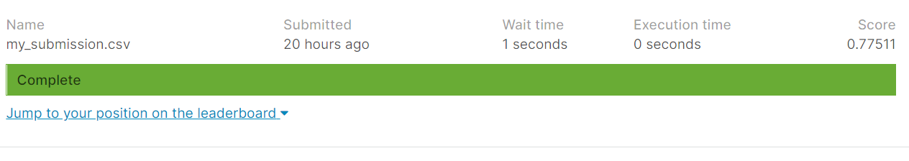
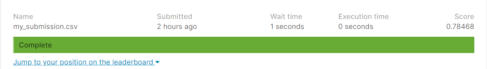
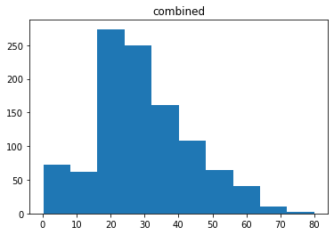
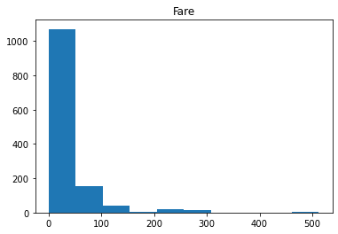
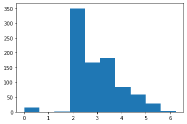
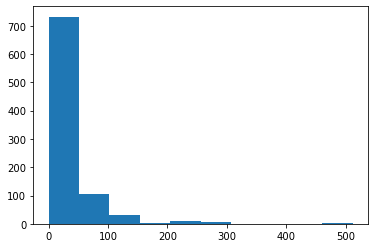
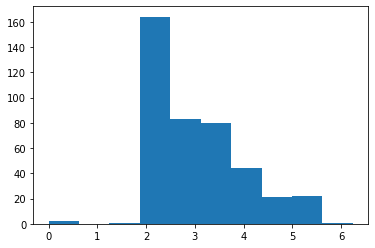
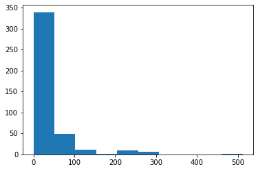

##  

 _Switch to dark mode for better readability_ 

#### Hypothesis score : 0.76555


#### 1st submission score : 0.77511



#### Final submission _improved_ score : 0.78468




[Scroll down to view the relevant code snippets, or click here to view the notebook on Kaggle](https://www.kaggle.com/rohanmandrekar/titanic)

#### My Contribution : 

After the first submission of the default code provided by Kaggle I obtained a score of 0.775. To figure out how I could improve this performance I decided to look at other submissions in the competition and browse the web. While doing so I came across [Ken Jee's tutorial on youtube.](https://www.youtube.com/watch?v=I3FBJdiExcg&list=WL&index=1&ab_channel=KenJee) After going through the tutorial I realized I should explore the data and find out if there are any Null values. On doing so I found the category 'Age' had quite a few missing values. I then plotted the values of the category 'Age' on a histogram to see if the values are well-distributed or skewed to one side. On observing the histogram, I realised the values are fairly distributed and hence, I can use the mean of 'Age' to replace the missing values. I then decided to run the model on this updated data. But to my dismay I found that the new score was 0.77272, which was lower than the previous score.

In my next attempt to increase the score I thought of using a different model for prediction. After seeing fair results with the K Nearest Neighbors (KNN) model in [Ken Jee's Kaggle notebook ](https://www.kaggle.com/kenjee/titanic-project-example) I decided to implement it in my notebook. But this time again I noticed a further decrease in my score getting a score of 0.72727. So i attempted to adjust the parameters of KNN model, adjusting n-neighbors=3 which caused a further dip in my score fetching me a 0.70574.

Hoping to get better results, I tried using a Support Vector Machine algorithm (SVC in SKLearn), this time getting an even lower score of 0.66267!
In another attempt I tried to implement the Voting Classifier on the Random Forest Classifier, KNN, and SVM models. Doing this got me an increase in my score, getting me 0.77272 which was still lower than the first submission.

So, I went back to the data to explore a little more. I replaced the one missing null value in the 'Fare' attribute. Plotting a histogram of the fare attribute revealed that the data was skewed to one side and therefore needed to be normalised. I then created a new attribute named 'norm_fare' and added the normalised values of the fare to it. I added 'norm_fare' to the list of features to train the data. I chose Random Forest Classifier as the model this time since it fetched the best results. On running the model this time, I was finally able to increase my score to 0.78468. A small change in score but I did learn from it nevertheless.


```python
train_data.isnull().sum()
```


    PassengerId      0
    Survived         0
    Pclass           0
    Name             0
    Sex              0
    Age            177
    SibSp            0
    Parch            0
    Ticket           0
    Fare             0
    Cabin          687
    Embarked         2
    dtype: int64


```python
test_data.isnull().sum()
```


    PassengerId      0
    Pclass           0
    Name             0
    Sex              0
    Age             86
    SibSp            0
    Parch            0
    Ticket           0
    Fare             1
    Cabin          327
    Embarked         0
    dtype: int64


```python
combined=pd.concat([train_data,test_data])
plt.hist(combined['Age'])
plt.title('combined')
```


    Text(0.5, 1.0, 'combined')





```python
plt.hist(combined['Fare'])
plt.title('Fare')
plt.show()
```





```python
#referred https://www.kaggle.com/kenjee/titanic-project-example 
#also https://www.youtube.com/watch?v=I3FBJdiExcg&list=WL&index=1&ab_channel=KenJee

print(combined.Age.mean())
print(combined.Age.median())

test_data.Fare=test_data.Fare.fillna(combined.Age.median())

train_data.Age=train_data.Age.fillna(combined.Age.mean())
test_data.Age=test_data.Age.fillna(combined.Age.mean())


print('\ntrain null val : ')
print(train_data.isnull().sum())

print('\ntest null val : ')
print(test_data.isnull().sum())
```

    29.881137667304014
    28.0
    
    train null val : 
    PassengerId      0
    Survived         0
    Pclass           0
    Name             0
    Sex              0
    Age              0
    SibSp            0
    Parch            0
    Ticket           0
    Fare             0
    Cabin          687
    Embarked         2
    dtype: int64
    
    test null val : 
    PassengerId      0
    Pclass           0
    Name             0
    Sex              0
    Age              0
    SibSp            0
    Parch            0
    Ticket           0
    Fare             0
    Cabin          327
    Embarked         0
    dtype: int64
    


```python
#referred https://www.kaggle.com/kenjee/titanic-project-example 
#also https://www.youtube.com/watch?v=I3FBJdiExcg&list=WL&index=1&ab_channel=KenJee
train_data['norm_fare']=np.log(train_data.Fare+1)
test_data['norm_fare']=np.log(test_data.Fare+1)


plt.hist(train_data['norm_fare'])
plt.show()
plt.hist(train_data['Fare'])
plt.show()
plt.hist(test_data['norm_fare'])
plt.show()
plt.hist(test_data['Fare'])
plt.show()
```














```python
from sklearn.ensemble import RandomForestClassifier
from sklearn.neighbors import KNeighborsClassifier
from sklearn.svm import SVC
from sklearn.ensemble import VotingClassifier

y = train_data["Survived"]

features = ["Pclass", "Sex", "SibSp", "Parch","Age","norm_fare"]
X = pd.get_dummies(train_data[features])
X_test = pd.get_dummies(test_data[features])

model = RandomForestClassifier(n_estimators=100, max_depth=5, random_state=1)

#referred https://www.kaggle.com/kenjee/titanic-project-example 
#also https://www.youtube.com/watch?v=I3FBJdiExcg&list=WL&index=1&ab_channel=KenJee

#kn = KNeighborsClassifier()
#sv = SVC(probability = True)
#model=VotingClassifier(estimators = [('knn',kn),('rf',rf),('svm',sv)], voting = 'soft')

model.fit(X, y)
predictions = model.predict(X_test)

output = pd.DataFrame({'PassengerId': test_data.PassengerId, 'Survived': predictions})
output.to_csv('my_submission.csv', index=False)
print("Your submission was successfully saved!")
```

    Your submission was successfully saved!
    


```python

```


